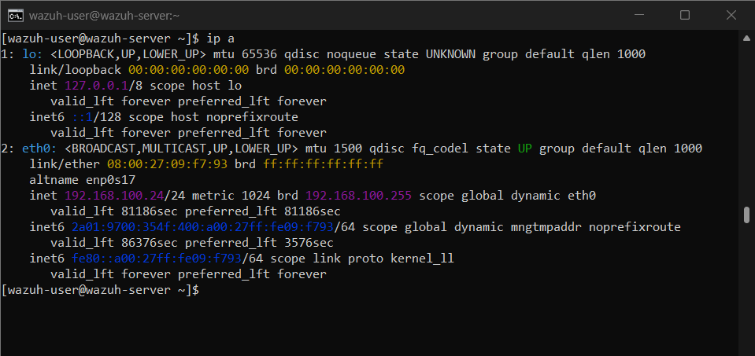
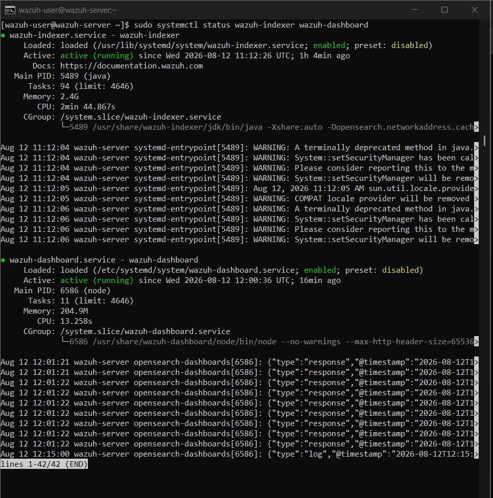
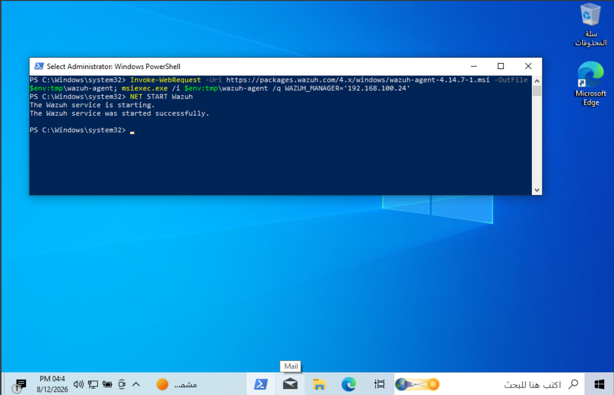
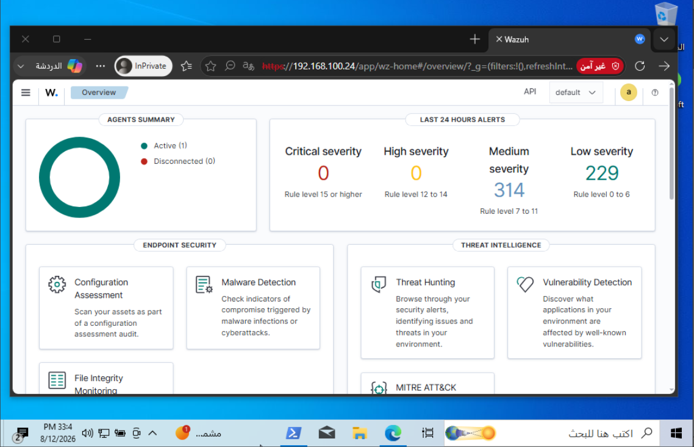
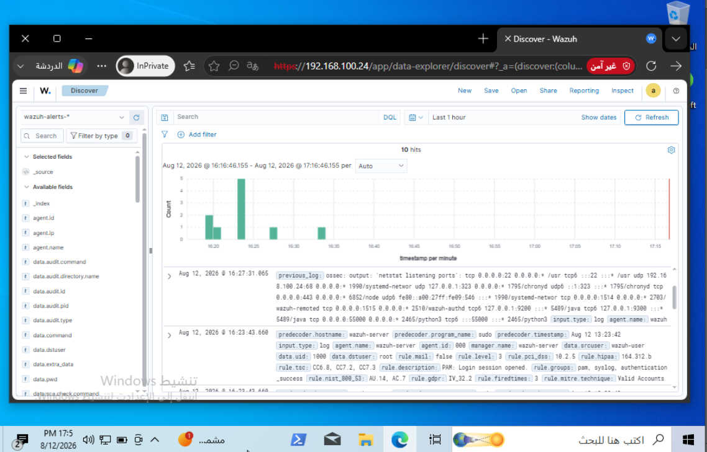
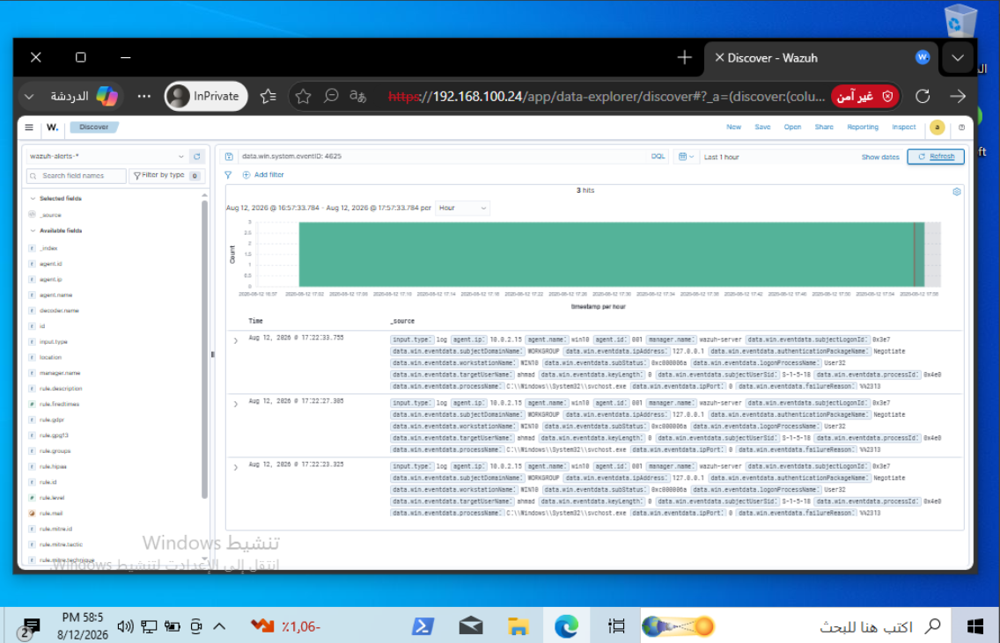

# 🛡️ Wazuh SIEM & Elastic Stack / OpenSearch Threat Detection Lab

## 📌 Project Overview
This project demonstrates the deployment and implementation of an enterprise-grade **Wazuh SIEM / XDR** environment integrated with **Elastic Stack / OpenSearch** for log analysis, threat hunting, and security monitoring. 

The primary objective is to construct a live lab environment to monitor a Windows 10 endpoint, stream real-time system/security telemetry, and detect malicious security events (such as unauthorized authentication attempts).

---

## 🏗️ Lab Architecture & Environment Specifications

| Component | Technology / Detail | IP Address / Identity |
| :--- | :--- | :--- |
| **Hypervisor** | Oracle VM VirtualBox | Host Machine Environment |
| **SIEM / XDR Server** | Wazuh Server OVA (Indexer, Manager, Dashboard) | `192.168.100.24` |
| **Search & Analytics Engine** | OpenSearch (Elastic Stack Based) | Port `9200` / `443` |
| **Target Endpoint (Agent)** | Windows 10 Enterprise | `Agent ID: 001` / `win10` |

---

## 🛠️ Tools & Technologies Used
* **Wazuh SIEM / XDR**: Security monitoring, rule evaluation, and endpoint integrity management.
* **Elastic Stack / OpenSearch**: Real-time log indexing (`Wazuh Indexer`), query engine, and visual telemetry dashboards (`Wazuh Dashboard` / Kibana-like UI).
* **PowerShell**: Command-line interface used for administrative deployment of the agent on Windows.
* **Oracle VM VirtualBox**: Virtualization environment for hosting isolated infrastructure.

---

## 🚀 Implementation & Deployment Steps

### Step 1: Server Network & Service Verification
1. Deployed the **Wazuh OVA** appliance on VirtualBox.
2. Verified the assigned network address (`192.168.100.24`) via the server CLI.
3. Confirmed the operational status of core indexing and visualization services (`wazuh-indexer` and `wazuh-dashboard`) using systemctl.

*Figure 1: Identifying the assigned server IP address on the network.*

*Figure 2: Verifying active status for Wazuh Indexer & Dashboard services.*

---

### Step 2: Agent Deployment & Enrollment
1. Generated a tailored agent installation script from the Wazuh Management Console targeting the manager IP `192.168.100.24`.
2. Executed the installation script via an elevated PowerShell session on the **Windows 10** host.
3. Successfully started the `WazuhSvc` service and validated active registration.

*Figure 3: Executing the agent installation and verifying successful service startup.*

*Figure 4: Confirming active agent connection (`1 Active Agent`) on the Wazuh Dashboard.*

---

## 🔍 Security Operations & Threat Detection

### 1. Log Ingestion & Stream Analysis
Using the **Wazuh Discover** module (powered by OpenSearch Indexing), real-time logs streamed from `win10` were parsed and mapped under the `wazuh-alerts-*` index pattern.

*Figure 5: Streaming and inspecting live log events within the Discover analytics UI.*

---

### 2. Threat Simulation & Real-time Alert Detection
* **Attack Scenario**: Simulated a **Brute-Force / Unauthorized Access** attempt by generating multiple consecutive failed logon attempts on the Windows 10 endpoint.
* **Detection Rule**: Triggered Windows Event ID **4625** (`An account failed to log on`).
* **SIEM Response**: The alert was ingested, correlated, and categorized instantly with error status `0xc000006a` (Bad Password).

*Figure 6: Real-time detection and correlation of Logon Failure (Event ID 4625) from agent `win10`.*

---

## 🎯 Key Achievements & Findings
* Successfully deployed a functional SIEM infrastructure with automated log ingestion.
* Validated real-time event correlation between Windows endpoints and the central Indexer engine.
* Conducted threat hunting operations using custom DQL queries and event ID filters.

---

## ⚠️ Limitations & Solution Considerations
* **Resource Allocation**: OpenSearch indexers require sufficient memory allocation; low RAM allocation may result in index creation delays upon initial agent registration.
* **Audit Policy Dependency**: Real-time detection of Event ID 4625 depends on active `Audit Logon Events` policies enabled on the target Windows system.
